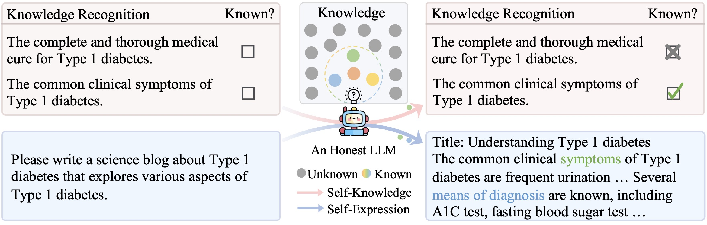
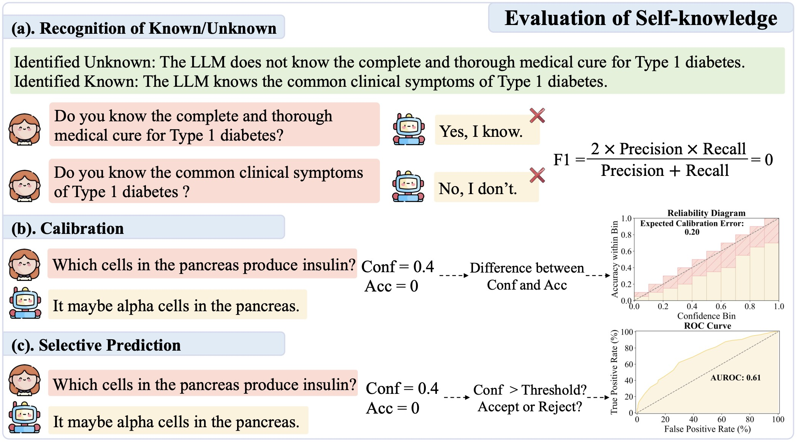
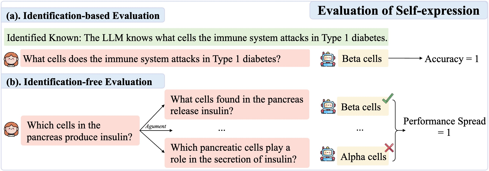
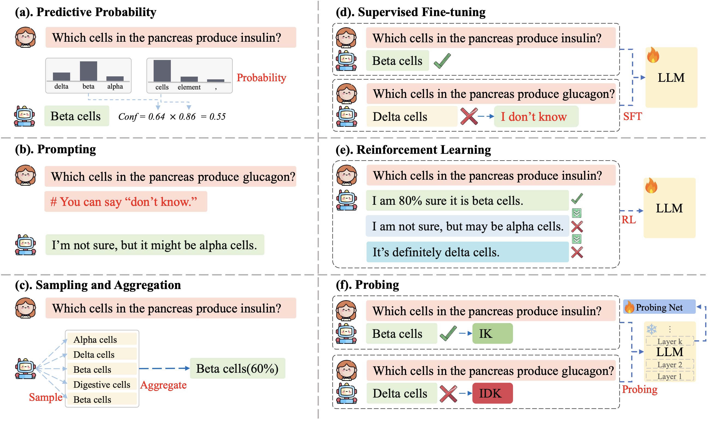
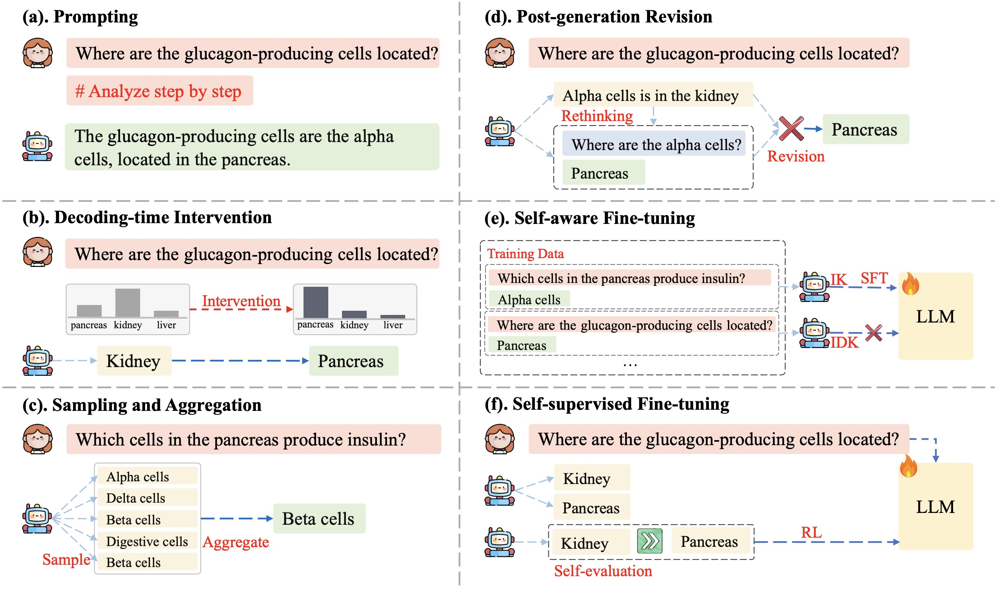

# A Survey on the Honesty of Large Language Models
 

[](https://opensource.org/licenses/MIT)
 

This repository offers a comprehensive collection of papers exploring the honesty of LLMs, covering its clarification, evaluation approaches, and strategies for improvement. Dive deeper into these studies by reading our in-depth survey: [A Survey on the Honesty of Large Language Models]().

## Table of Content
- [What is This Survey About?](#-what-is-this-survey-about)
- [Honesty in LLMs](#-honesty-in-llms)
  - [What is Honesty in LLMs](#what-is-honesty-in-llms)
  - [Self-knowledge](#self-knowledge)
  - [Self-consistency](#self-consistency)
- [Evaluation of LLM Honesty](#evaluation-of-llm-honesty)
  - [Self-knowledge](#self-knowledge-1)
    - [Recognition of Known/Unknown](#recognition-of-knownunknown)
    - [Calibration](#calibration)
    - [Selective Prediction](#selective-prediction)
  - [Self-consistency](#self-consistency-1)
    - [Reference-based Evaluation](#reference-based-evaluation)
    - [Reference-free Evaluation](#reference-free-evaluation)
- [Methods of Self-knowledge](#methods-of-self-knowledge)
  - [Training-free Approaches](#training-free-approaches)
    - [Predictive Probability](#predictive-probability)
    - [Prompting](#prompting)
    - [Sampling and Aggregation](#sampling-and-aggregation)
  - [Training-based Approaches](#training-based-approaches)
    - [Supervised Fine-tuning](#supervised-fine-tuning)
    - [Reinforcement Learning](#reinforcement-learning)
    - [Probing](#probing)
- [Methods of Self-consistency](#methods-of-self-consistency)
  - [Training-free Approaches](#training-free-approaches-1)
    - [Chain-of-thought Prompting](#chain-of-thought-prompting)
    - [Decoding-time Intervention](#decoding-time-intervention)
    - [Sampling and Aggregation](#sampling-and-aggregation-1)
    - [Post-generation Revision](#post-generation-revision)
  - [Training-based Approaches](#training-based-approaches-1)
    - [Self-aware Fine-tuning](#self-aware-fine-tuning)
    - [Self-supervised Fine-tuning](#self-supervised-fine-tuning)


## Honesty in LLMs
### What is Honesty in LLMs

<div align="center">


<p><em>Figure 1: An illustration of an honest LLM that demonstrates both self-knowledge and self-expression.</em></p>

</div>
In this paper, we consider an LLM to be honest if it fulfills these two widely accepted criteria: *possessing both self-knowledge and self-expression*.
Self-knowledge involves the model being aware of its own capabilities, recognizing what it knows and what it
doesn’t, allowing it to acknowledge limitations or convey uncertainty when necessary. Self-expression refers
to the model’s ability to faithfully express its knowledge, leading to reliable outputs.
An illustrated example is shown in Fig. 1. 


- A general language assistant as a laboratory for alignment, <ins>arXiv, 2021</ins> [[Paper](https://arxiv.org/abs/2112.00861)]
- Language models (mostly) know what they know, <ins>arXiv, 2022</ins> [[Paper](http://arxiv.org/abs/2207.05221)]
- Truthful AI: Developing and governing AI that does not lie, <ins>arXiv, 2021</ins> [[Paper](https://arxiv.org/abs/2110.06674)]
- Teaching models to express their uncertainty in words, <ins>TMLR, 2022</ins> [[Paper](http://arxiv.org/abs/2205.14334)][[Code](https://github.com/sylinrl/CalibratedMath)]
- Alignment for honesty, <ins>arXiv, 2023</ins> [[Paper](http://arxiv.org/abs/2312.07000)][[Code](https://github.com/GAIR-NLP/alignment-for-honesty)]
- Behonest: Benchmarking honesty of large language models, <ins>arXiv, 2024</ins> [[Paper](http://arxiv.org/abs/2406.13261)][[Code](https://github.com/GAIR-NLP/BeHonest)]

### Self-knowledge
The self-knowledge capacity of LLMs hinges on their ability to recognize what they know and what they don’t know. This enables them to explicitly state “I don’t know” when lacking necessary knowledge, thereby avoiding making wrong statements. Additionally,
it also allows them to provide confidence or uncertainty indicators in responses to reflect the likelihood of their correctness.

- Self-knowledge, <ins>Routledge, 2010</ins> [[Paper](https://www.taylorfrancis.com/books/mono/10.4324/9780203835678/self-knowledge-brie-gertler)]
- A general language assistant as a laboratory for alignment, <ins>arXiv, 2021</ins> [[Paper](https://arxiv.org/abs/2112.00861)]
- Language models (mostly) know what they know, <ins>arXiv, 2022</ins> [[Paper](http://arxiv.org/abs/2207.05221)]
- Cognitive dissonance: Why do language model outputs disagree with internal representations of truthfulness?, <ins>EMNLP, 2023</ins> [[Paper](https://aclanthology.org/2023.emnlp-main.291/)][[Code](https://github.com/lingo-mit/lm-truthfulness)]
- Can AI assistants know what they don’t know?, <ins>ICML, 2024</ins> [[Paper](https://openreview.net/pdf?id=girxGkdECL)][[Code](https://github.com/OpenMOSS/Say-I-Dont-Know)]
- Behonest: Benchmarking honesty of large language models, <ins>arXiv, 2024</ins> [[Paper](http://arxiv.org/abs/2406.13261)][[Code](https://github.com/GAIR-NLP/BeHonest)]
- Alignment for honesty, <ins>arXiv, 2023</ins> [[Paper](http://arxiv.org/abs/2312.07000)][[Code](https://github.com/GAIR-NLP/alignment-for-honesty)]
- R-tuning: Instructing large language models to say ‘I don’t know’, <ins>NAACL, 2024</ins> [[Paper](http://arxiv.org/abs/2311.09677)][[Code](https://github.com/shizhediao/R-Tuning)]
- Teaching models to express their uncertainty in words, <ins>TMLR, 2022</ins> [[Paper](http://arxiv.org/abs/2205.14334)][[Code](https://github.com/sylinrl/CalibratedMath)]
- Sayself: Teaching LLMs to express confidence with self-reflective rationales, <ins>arXiv, 2024</ins> [[Paper](http://arxiv.org/abs/2405.20974)][[Code](https://github.com/xu1868/SaySelf)]
- LACIE: Listener-aware finetuning for confidence calibration in large language models, <ins>arXiv, 2024</ins> [[Paper](http://arxiv.org/abs/2405.21028)][[Code](https://github.com/esteng/pragmatic_calibration)]
- Don’t Hallucinate, Abstain: Identifying LLM Knowledge Gaps via Multi-LLM Collaboration<ins>ACL, 2024</ins> [[Paper](https://aclanthology.org/2024.acl-long.786/)][[Code](https://github.com/BunsenFeng/AbstainQA)]
- Know Your Limits: A Survey of Abstention in Large Language Models<ins>arXiv, 2024</ins> [[Paper](https://arxiv.org/abs/2407.18418)]
- Mitigating LLM hallucinations via conformal abstention, <ins>arXiv, 2024</ins> [[Paper](https://arxiv.org/abs/2405.01563)]
- Uncertainty-based abstention in LLMs improves safety and reduces hallucinations, <ins>arXiv, 2024</ins> [[Paper](https://arxiv.org/abs/2404.10960)]
- On Hallucination and Predictive Uncertainty in Conditional Language Generation, <ins>ECAL, 2021</ins> [[Paper](https://aclanthology.org/2021.eacl-main.236)]
- SelfCheckGPT: Zero-resource black-box hallucination detection for generative large language models, <ins>EMNLP, 2023</ins> [[Paper](https://arxiv.org/abs/2303.08896)][[Code](https://github.com/potsawee/selfcheckgpt)]
- Semantic entropy probes: Robust and cheap hallucination detection in LLMs, <ins>arXiv, 2024</ins> [[Paper](https://arxiv.org/abs/2406.15927)]
- INSIDE: LLMs' internal states retain the power of hallucination detection, <ins>ICLR, 2024</ins> [[Paper](https://arxiv.org/abs/2402.03744)]
- Detecting hallucinations in large language models using semantic entropy, <ins>Nature, 2024</ins> [[Paper](https://doi.org/10.1038/s41586-024-07421-0)][[Code](https://github.com/jlko/semantic_uncertainty)]
- Active retrieval augmented generation, <ins>EMNLP, 2023</ins> [[Paper](https://aclanthology.org/2023.emnlp-main.495/)][[Code](https://github.com/jzbjyb/FLARE)]
- Self-Knowledge Guided Retrieval Augmentation for Large Language Models, <ins>arXiv, 2023</ins> [[Paper](https://arxiv.org/abs/2310.05002)]
- When do LLMs need retrieval augmentation? Mitigating LLMs’ overconfidence helps retrieval augmentation, <ins>arXiv, 2024</ins> [[Paper](https://arxiv.org/abs/2402.11457)][[Code](https://github.com/ShiyuNee/When-to-Retrieve)]
- SEAKR: Self-Aware Knowledge Retrieval for Adaptive Retrieval Augmented Generation, <ins>ICLR, 2024</ins> [[Paper](https://arxiv.org/abs/2406.19215)][[Code](https://github.com/THU-KEG/SeaKR)][[Code](https://github.com/MurongYue/LLM_MoT_cascade)]
- Large Language Model Cascades with Mixture of Thoughts Representations for Cost-Efficient Reasoning, <ins>arXiv, 2024</ins> [[Paper](https://arxiv.org/abs/2310.03094)]
- Trust or Escalate: LLM Judges with Provable Guarantees for Human Agreement, <ins>arXiv, 2024</ins> [[Paper](https://arxiv.org/abs/2407.18370)][[Code](https://github.com/jaehunjung1/cascaded-selective-evaluation)]
- Language Model Cascades: Token-Level Uncertainty and Beyond, <ins>arXiv, 2024</ins> [[Paper](https://arxiv.org/abs/2404.10136)]
- Optimising Calls to Large Language Models with Uncertainty-Based Two-Tier Selection, <ins>arXiv, 2024</ins> [[Paper](https://arxiv.org/abs/2405.02134)]

### Self-consistency
Self-expression refers to the model’s ability to express its knowledge faithfully, either
parametric knowledge acquired through training or in-context knowledge. This enables the model to ground
its responses in its knowledge rather than fabricating information.

- Physics of Language Models: Part 3.1, Knowledge Storage and Extraction, <ins>arXiv, 2024</ins> [[Paper](https://arxiv.org/abs/2309.14316)]
- How Language Model Hallucinations Can Snowball, <ins>arXiv, 2024</ins> [[Paper](https://arxiv.org/abs/2305.13534)][[Code](https://github.com/Nanami18/Snowballed_Hallucination)]
- Inference-time intervention: Eliciting truthful answers from a language model, <ins>NeurIPS, 2024</ins> [[Paper](https://openreview.net/forum?id=aLLuYpn83y)][[Code](https://github.com/likenneth/honest_llama)]
- Lost in the middle: How language models use long contexts, <ins>TACL 2024</ins> [[Paper](https://aclanthology.org/2024.tacl-1.9/)]
- Trusting your evidence: Hallucinate less with context-aware decoding, <ins>NAACL, 2024</ins> [[Paper](http://arxiv.org/abs/2305.14739)]
- Hallucination of Multimodal Large Language Models: A Survey, <ins>arXiv, 2024</ins> [[Paper](https://arxiv.org/abs/2404.18930)]
- Robustness of Learning from Task Instructions, <ins>ACL Findings, 2023</ins> [[Paper](https://arxiv.org/abs/2212.03813)]
- State of what art? A call for multi-prompt LLM evaluation, <ins>TACL, 2024</ins> [[Paper](http://arxiv.org/abs/2407.07840)][[Code](https://github.com/SLAB-NLP/Multi-Prompt-LLM-Evaluation)]
- On the robustness of ChatGPT: An adversarial and out-of-distribution perspective, <ins>ICLR Workshop, 2023</ins> [[Paper](https://arxiv.org/abs/2302.12095)][[Code](https://github.com/microsoft/robustlearn)]
- Quantifying language models’ sensitivity to spurious features in prompt design or: How I learned to start worrying about prompt formatting, <ins>ICLR, 2024</ins> [[Paper](http://arxiv.org/abs/2310.11324)][[Code](https://github.com/msclar/formatspread)]
- On the worst prompt performance of large language models, <ins>arXiv, 2024</ins> [[Paper](http://arxiv.org/abs/2406.10248)][[Code](https://github.com/cbwbuaa/On-the-Worst-Prompt-Performance-of-LLMs)]
- Simple synthetic data reduces sycophancy in large language models, <ins>arXiv, 2023</ins> [[Paper](https://arxiv.org/abs/2308.03958)][[Code](https://github.com/google/sycophancy-intervention)]
- Towards Robust and Faithful Summarization with Large Language Models, <ins>arXiv, 2024</ins> [[Paper](https://arxiv.org/abs/2404.05512)]
- TrustLLM: Trustworthiness in Large Language Models, <ins>arXiv, 2024</ins> [[Paper](https://arxiv.org/abs/2401.05561)][[Code](https://github.com/HowieHwong/TrustLLM)]

## Evaluation of LLM Honesty
### Self-knowledge
<div align="center">

<p><em>Figure 2: Illustrations of self-knowledge evaluation, encompassing the recognition of known/unknown, calibration, and selective prediction. “Conf” indicates the LLM’s confidence score and “Acc” represents the
accuracy of the response.</em></p>
</div>

#### Recognition of Known/Unknown
- Do large language models know what they don’t know?, <ins>ACL Findings, 2023</ins> [[Paper](http://arxiv.org/abs/2305.18153)][[Code](https://github.com/yinzhangyue/SelfAware)]
- Knowledge of knowledge: Exploring known-unknowns uncertainty with large language models, <ins>arXiv, 2023</ins> [[Paper](http://arxiv.org/abs/2305.13712)][[Code](https://github.com/amayuelas/knowledge-of-knowledge)]
- Examining LLMs’ uncertainty expression towards questions outside parametric knowledge, <ins>arXiv, 2024a</ins> [[Paper](http://arxiv.org/abs/2311.09731)][[Code](https://github.com/genglinliu/UnknownBench)]
- The best of both worlds: Toward an honest and helpful large language model, <ins>arXiv, 2024</ins> [[Paper](http://arxiv.org/abs/2406.00380)][[Code](https://github.com/Flossiee/HonestyLLM)]
- Behonest: Benchmarking honesty of large language models, <ins>arXiv, 2024</ins> [[Paper](http://arxiv.org/abs/2406.13261)][[Code](https://github.com/GAIR-NLP/BeHonest)]
- Can AI assistants know what they don’t know?, <ins>ICML, 2024</ins> [[Paper](https://openreview.net/pdf?id=girxGkdECL)][[Code](https://github.com/OpenMOSS/Say-I-Dont-Know)]

#### Calibration
- On calibration of modern neural networks, <ins>ICML, 2017</ins> [[Paper](https://arxiv.org/abs/1706.04599)]
- Just ask for calibration: Strategies for eliciting calibrated confidence scores from language models fine-tuned with human feedback, <ins>EMNLP, 2023</ins> [[Paper](https://aclanthology.org/2023.emnlp-main.330/)]
- A survey of confidence estimation and calibration in large language models, <ins>NAACL, 2024</ins> [[Paper](https://arxiv.org/abs/2311.08298)]
- On the Calibration of Large Language Models and Alignment, <ins>EMNLP Findings, 2023</ins> [[Paper](https://aclanthology.org/2023.findings-emnlp.654/)]
- Can LLMs express their uncertainty? An empirical evaluation of confidence elicitation in LLMs, <ins>ICLR, 2024</ins> [[Paper](https://arxiv.org/abs/2306.13063)][[Code](https://github.com/MiaoXiong2320/llm-uncertainty)]
- Calibrating large language models with sample consistency, <ins>arXiv, 2024</ins> [[Paper](https://arxiv.org/abs/2402.13904)]


#### Selective Prediction
- Out-of-Distribution Detection and Selective Generation for Conditional Language Models, <ins>ICLR, 2023</ins> [[Paper](https://arxiv.org/abs/2209.15558)]
- Can LLMs express their uncertainty? An empirical evaluation of confidence elicitation in LLMs, <ins>ICLR, 2024</ins> [[Paper](http://arxiv.org/abs/2306.13063)][[Code](https://github.com/MiaoXiong2320/llm-uncertainty)]
- Adaptation with self-evaluation to improve selective prediction in llm, <ins>EMNLP Findings, 2023</ins> [[Paper](https://arxiv.org/abs/2310.11689)]
- Uncertainty-based abstention in LLMs improves safety and reduces hallucinations, <ins>arXiv, 2024</ins> [[Paper](http://arxiv.org/abs/2404.10960)]
- Sayself: Teaching LLMs to express confidence with self-reflective rationales, <ins>arXiv, 2024</ins> [[Paper](http://arxiv.org/abs/2405.20974)][[Code](https://github.com/xu1868/SaySelf)]
- Factual confidence of LLMs: On reliability and robustness of current estimators, <ins>ACL, 2024</ins> [[Paper](https://aclanthology.org/2024.acl-long.250/)][[Code](https://github.com/amazon-science/factual-confidence-of-llms)]
- Self-evaluation improves selective generation in large language models, <ins>NeurIPS Workshop, 2023</ins> [[Paper](http://arxiv.org/abs/2312.09300)]
- A survey of confidence estimation and calibration in large language models, <ins>NAACL, 2024</ins> [[Paper](http://arxiv.org/abs/2311.08298)]
- Generating with confidence: Uncertainty quantification for black-box large language models, <ins>TMLR, 2024</ins> [[Paper](https://arxiv.org/pdf/2305.19187)][[Code](https://github.com/zlin7/UQ-NLG)]
- Getting MoRE out of Mixture of Language Model Reasoning Experts, <ins>EMNLP Findings, 2023</ins> [[Paper](https://aclanthology.org/2023.findings-emnlp.552.pdf)] [[Code](https://github.com/NoviScl/MoRE)]

### Self-consistency
<div align="center">

<p><em>Figure 3: Illustrations of self-expression evaluation, encompassing both identification-based and
identification-free approaches.</em></p>
</div>
#### Identification-based Evaluation
- Do large language models know what they don’t know?, <ins>ACL Findings, 2023</ins> [[Paper](http://arxiv.org/abs/2305.18153)][[Code](https://github.com/yinzhangyue/SelfAware)]
- Knowledge of knowledge: Exploring known-unknowns uncertainty with large language models, <ins>arXiv, 2023</ins> [[Paper](http://arxiv.org/abs/2305.13712)][[Code](https://github.com/amayuelas/knowledge-of-knowledge)]
- Examining LLMs’ uncertainty expression towards questions outside parametric knowledge, <ins>arXiv, 2024a</ins> [[Paper](http://arxiv.org/abs/2311.09731)][[Code](https://github.com/genglinliu/UnknownBench)]
- The best of both worlds: Toward an honest and helpful large language model, <ins>arXiv, 2024</ins> [[Paper](http://arxiv.org/abs/2406.00380)][[Code](https://github.com/Flossiee/HonestyLLM)]
- Behonest: Benchmarking honesty of large language models, <ins>arXiv, 2024</ins> [[Paper](http://arxiv.org/abs/2406.13261)][[Code](https://github.com/GAIR-NLP/BeHonest)]
- Can AI assistants know what they don’t know?, <ins>ICML, 2024</ins> [[Paper](https://openreview.net/pdf?id=girxGkdECL)][[Code](https://github.com/OpenMOSS/Say-I-Dont-Know)]

#### Identification-free Evaluation
- Quantifying language models’ sensitivity to spurious features in prompt design or: How I learned to start worrying about prompt formatting, <ins>ICLR, 2024</ins> [[Paper](http://arxiv.org/abs/2310.11324)][[Code](https://github.com/msclar/formatspread)]
- Behonest: Benchmarking honesty of large language models, <ins>arXiv, 2024</ins> [[Paper](http://arxiv.org/abs/2406.13261)][[Code](https://github.com/GAIR-NLP/BeHonest)]
- State of what art? A call for multi-prompt LLM evaluation, <ins>TACL, 2024</ins> [[Paper](http://arxiv.org/abs/2407.07840)][[Code](https://github.com/SLAB-NLP/Multi-Prompt-LLM-Evaluation)]
- On the worst prompt performance of large language models, <ins>arXiv, 2024</ins> [[Paper](http://arxiv.org/abs/2406.10248)][[Code](https://github.com/cbwbuaa/On-the-Worst-Prompt-Performance-of-LLMs)]
- TrustLLM: Trustworthiness in Large Language Models, <ins>arXiv, 2024</ins> [[Paper](https://arxiv.org/abs/2401.05561)][[Code](https://github.com/HowieHwong/TrustLLM)]
- Simple synthetic data reduces sycophancy in large language models, <ins>arXiv, 2023</ins> [[Paper](https://arxiv.org/abs/2308.03958)]
- Benchmarking and improving generator-validator consistency of language models, <ins>ICLR, 2024</ins> [[Paper](http://arxiv.org/abs/2310.01846)][[Code](https://github.com/XiangLi1999/GV-consistency)]

## Methods of Self-knowledge
<div align="center">

<p><em>Figure 4: Improvement of self-knowledge, encompassing both training-based and training-free approaches.</em></p>
</div>
### Training-free Approaches
#### Predictive Probability
- Uncertainty quantification with pre-trained language models: A large-scale empirical analysis, <ins>EMNLP Findings, 2022</ins> [[Paper](http://arxiv.org/abs/2210.04714)][[Code](https://github.com/xiaoyuxin1002/UQ-PLM.git)]
- Language models (mostly) know what they know, <ins>arXiv, 2022</ins> [[Paper](http://arxiv.org/abs/2207.05221)]
- Semantic uncertainty: Linguistic invariances for uncertainty estimation in natural language generation, <ins>ICLR, 2023</ins> [[Paper](http://arxiv.org/abs/2302.09664)][[Code](https://github.com/lorenzkuhn/semantic_uncertainty)]
- Self-evaluation improves selective generation in large language models, <ins>NeurIPS Workshop, 2023</ins> [[Paper](http://arxiv.org/abs/2312.09300)]
- Shifting attention to relevance: Towards the uncertainty estimation of large language models, <ins>ACL, 2024</ins> [[Paper](http://arxiv.org/abs/2307.01379)][[Code](https://github.com/jinhaoduan/SAR)]
- Uncertainty estimation in autoregressive structured prediction, <ins>ICLR, 2021</ins> [[Paper](https://arxiv.org/abs/2002.07650)]
- Prompting gpt-3 to be reliable, <ins>ICLR, 2023</ins> [[Paper](https://arxiv.org/abs/2210.09150)][[Code](https://github.com/NoviScl/GPT3-Reliability)]

#### Prompting
- Language models (mostly) know what they know, <ins>arXiv, 2022</ins> [[Paper](http://arxiv.org/abs/2207.05221)]
- Fact-and-reflection (FAR) improves confidence calibration of large language models, <ins>ACL Findings, 2024</ins> [[Paper](https://aclanthology.org/2024.findings-acl.515/)]
- Self-[in]correct: LLMs struggle with refining self-generated responses, <ins>arXiv, 2024</ins> [[Paper](http://arxiv.org/abs/2404.04298)]
- Do large language models know what they don’t know? <ins>ACL Findings, 2023</ins> [[Paper](http://arxiv.org/abs/2305.18153)][[Code](https://github.com/yinzhangyue/SelfAware)]
- Just ask for calibration: Strategies for eliciting calibrated confidence scores from language models fine-tuned with human feedback, <ins>EMNLP, 2023</ins> [[Paper](https://aclanthology.org/2023.emnlp-main.330/)]
- Can LLMs express their uncertainty? An empirical evaluation of confidence elicitation in LLMs, <ins>ICLR, 2024</ins> [[Paper](https://arxiv.org/abs/2306.13063)][[Code](https://github.com/MiaoXiong2320/llm-uncertainty)]
- Navigating the grey area: How expressions of uncertainty and overconfidence affect language models, <ins>EMNLP, 2023</ins> [[Paper](http://arxiv.org/abs/2302.13439)][[Code](https://github.com/katezhou/navigating_the_grey)]

#### Sampling and Aggregation
- Can LLMs express their uncertainty? An empirical evaluation of confidence elicitation in LLMs, <ins>ICLR, 2024</ins> [[Paper](https://arxiv.org/abs/2306.13063)][[Code](https://github.com/MiaoXiong2320/llm-uncertainty)]
- Just rephrase it! Uncertainty estimation in closed-source language models via multiple rephrased queries, <ins>arXiv, 2024</ins> [[Paper](http://arxiv.org/abs/2405.13907)]
- Prompt consistency for zero-shot task generalization, <ins>EMNLP Findings, 2022</ins> [[Paper](http://arxiv.org/abs/2205.00049)][[Code](https://github.com/violet-zct/swarm-distillation-zero-shot)]
- Calibrating large language models with sample consistency, <ins>arXiv, 2024</ins> [[Paper](http://arxiv.org/abs/2402.13904)]
- Semantic uncertainty: Linguistic invariances for uncertainty estimation in natural language generation, <ins>ICLR, 2023</ins> [[Paper](http://arxiv.org/abs/2302.09664)][[Code](https://github.com/lorenzkuhn/semantic_uncertainty)]
- Generating with confidence: Uncertainty quantification for black-box large language models, <ins>TMLR, 2024</ins> [[Paper](http://arxiv.org/abs/2305.19187)][[Code](https://github.com/zlin7/UQ-NLG)]
- SelfCheckGPT: Zero-resource black-box hallucination detection for generative large language models, <ins>EMNLP, 2023</ins> [[Paper](https://arxiv.org/abs/2303.08896)][[Code](https://github.com/potsawee/selfcheckgpt)]
- Mitigating LLM hallucinations via conformal abstention, <ins>arXiv, 2024</ins> [[Paper](http://arxiv.org/abs/2405.01563)]
- Calibrating long-form generations from large language models, <ins>arXiv, 2024</ins> [[Paper](http://arxiv.org/abs/2402.06544)]
- Detecting hallucinations in large language models using semantic entropy, <ins>Nature, 2024</ins> [[Paper](https://doi.org/10.1038/s41586-024-07421-0)][[Code](https://github.com/jlko/semantic_uncertainty)]
- Fact-checking the output of large language models via token-level uncertainty quantification, <ins>ACL Findings, 2024</ins> [[Paper](http://arxiv.org/abs/2403.04696)][[Code](https://github.com/IINemo/lm-polygraph)]

### Training-based Approaches
#### Supervised Fine-tuning
- Alignment for honesty, <ins>arXiv, 2023</ins> [[Paper](http://arxiv.org/abs/2312.07000)][[Code](https://github.com/GAIR-NLP/alignment-for-honesty)]
- R-tuning: Instructing large language models to say ‘I don’t know’, <ins>NAACL, 2024</ins> [[Paper](http://arxiv.org/abs/2311.09677)][[Code](https://github.com/shizhediao/R-Tuning)]
- Can AI assistants know what they don’t know?, <ins>ICML, 2024</ins> [[Paper](https://openreview.net/pdf?id=girxGkdECL)][[Code](https://github.com/OpenMOSS/Say-I-Dont-Know)]
- Teaching large language models to express knowledge boundary from their own signals, <ins>arXiv, 2024</ins> [[Paper](https://arxiv.org/abs/2406.10881)]
- Knowledge verification to nip hallucination in the bud, <ins>arXiv, 2024</ins> [[Paper](https://arxiv.org/abs/2401.10768)][[Code](https://github.com/fanqiwan/KCA)]
- Large language models must be taught to know what they don’t know, <ins>arXiv, 2024</ins> [[Paper](http://arxiv.org/abs/2406.08391)][[Code](https://github.com/activatedgeek/calibration-tuning)]
- Teaching models to express their uncertainty in words, <ins>TMLR, 2022</ins> [[Paper](http://arxiv.org/abs/2205.14334)][[Code](https://github.com/sylinrl/CalibratedMath)]
- Calibrating large language models using their generations only, <ins>arXiv, 2024</ins> [[Paper](http://arxiv.org/abs/2403.05973)][[Code](https://github.com/parameterlab/apricot)]
- Enhancing confidence expression in large language models through learning from past experience, <ins>arXiv, 2024</ins> [[Paper](http://arxiv.org/abs/2404.10315)]

#### Reinforcement Learning
- Can AI assistants know what they don’t know?, <ins>ICML, 2024</ins> [[Paper](https://openreview.net/pdf?id=girxGkdECL)][[Code](https://github.com/OpenMOSS/Say-I-Dont-Know)]
- Rejection improves reliability: Training LLMs to refuse unknown questions using RL from knowledge feedback, <ins>COLM, 2024</ins> [[Paper](http://arxiv.org/abs/2403.18349)]
- The best of both worlds: Toward an honest and helpful large language model, <ins>arXiv, 2024</ins> [[Paper](http://arxiv.org/abs/2406.00380)][[Code](https://github.com/Flossiee/HonestyLLM)]
- Sayself: Teaching LLMs to express confidence with self-reflective rationales, <ins>arXiv, 2024b</ins> [[Paper](http://arxiv.org/abs/2405.20974)][[Code](https://github.com/xu1868/SaySelf)]
- LACIE: Listener-aware finetuning for confidence calibration in large language models, <ins>arXiv, 2024</ins> [[Paper](http://arxiv.org/abs/2405.21028)][[Code](https://github.com/esteng/pragmatic_calibration)]
- Linguistic calibration of long-form generations, <ins>ICML, 2024</ins> [[Paper](http://arxiv.org/abs/2404.00474)][[Code](https://github.com/tatsu-lab/linguistic_calibration)]

#### Probing
- Language models (mostly) know what they know, <ins>arXiv, 2022</ins> [[Paper](http://arxiv.org/abs/2207.05221)]
- The internal state of an LLM knows when it’s lying, <ins>EMNLP Findings, 2023</ins> [[Paper](http://arxiv.org/abs/2304.13734)]
- The geometry of truth: Emergent linear structure in large language model representations of true/false datasets, <ins>COLM, 2024</ins> [[Paper](http://arxiv.org/abs/2310.06824)][[Code](https://github.com/saprmarks/geometry-of-truth)]
- On the universal truthfulness hyperplane inside LLMs, <ins>arXiv, 2024</ins> [[Paper](http://arxiv.org/abs/2408.10692)]
- Discovering latent knowledge in language models without supervision, <ins>ICLR, 2023</ins> [[Paper](http://arxiv.org/abs/2212.03827)][[Code](https://www.github.com/collin-burns/discovering_latent_knowledge)]
- Semantic entropy probes: Robust and cheap hallucination detection in LLMs, <ins>arXiv, 2024</ins> [[Paper](http://arxiv.org/abs/2406.15927)]
- LLM internal states reveal hallucination risk faced with a query, <ins>arXiv, 2024</ins> [[Paper](https://arxiv.org/abs/2407.03282v1)]

## Methods of Self-consistency
<div align="center">

<p><em>Figure 5: Improvement of self-expression, encompassing both training-based and training-free approaches.</em></p>
</div>

### Training-free Approaches
#### Chain-of-thought Prompting
- Chain-of-thought prompting elicits reasoning in large language models, <ins>NeurIPS, 2022</ins> [[Paper](http://arxiv.org/abs/2201.11903)]
- Large Language Models are Zero-Shot Reasoners, <ins>NeurIPS, 2022</ins> [[Paper](https://arxiv.org/abs/2205.11916)]
- Least-to-most prompting enables complex reasoning in large language models, <ins>ICLR, 2023</ins> [[Paper](http://arxiv.org/abs/2305.01341)]
- Measuring and Narrowing the Compositionality Gap in Language Models, <ins>EMNLP Findings, 2023</ins> [[Paper](https://arxiv.org/abs/2210.03350)][[Code](https://github.com/ofirpress/self-ask)]
- Take a step back: Evoking reasoning via abstraction in large language models, <ins>ICLR, 2024</ins> [[Paper](http://arxiv.org/abs/2304.03461)]
- Plan-andsolve prompting: Improving zero-shot chain-of-thought reasoning by large language models, <ins>ACL, 2023</ins> [[Paper](https://arxiv.org/abs/2305.04091)][[Code](https://github.com/AGI-Edgerunners/Plan-and-Solve-Prompting)]
- Fact-and-Reflection (FaR) Improves Confidence Calibration of Large Language Models, <ins>ACL Findings, 2024</ins> [[Paper](https://aclanthology.org/2024.findings-acl.515/)][[Code](https://github.com/colinzhaoust/fact-and-reflection)]

#### Decoding-time Intervention
- Inference-time intervention: Eliciting truthful answers from a language model, <ins>NeurIPS, 2024</ins> [[Paper](https://openreview.net/forum?id=aLLuYpn83y)][[Code](https://github.com/likenneth/honest_llama)]
- In-context sharpness as alerts: An inner representation perspective for hallucination mitigation, <ins>ICML, 2024</ins> [[Paper](http://arxiv.org/abs/2404.04298)][[Code](https://github.com/hkust-nlp/Activation_decoding.git)]
- Dola: Decoding by contrasting layers improves factuality in large language models, <ins>ICLR, 2024</ins> [[Paper](http://arxiv.org/abs/2309.03883)][[Code](https://github.com/voidism/DoLa)]
- Alleviating hallucinations of large language models through induced hallucinations, <ins>arXiv, 2023b</ins> [[Paper](http://arxiv.org/abs/2312.15710)][[Code](https://github.com/hillzhang1999/ICD)]
- Trusting your evidence: Hallucinate less with context-aware decoding, <ins>NAACL, 2024</ins> [[Paper](http://arxiv.org/abs/2305.14739)]
- Mitigating object hallucinations in large vision-language models through visual contrastive decoding, <ins>CVPR, 2024</ins> [[Paper](http://arxiv.org/abs/2406.03441)][[Code](https://github.com/DAMO-NLP-SG/VCD)]

#### Sampling and Aggregation
- Self-consistency improves chain of thought reasoning in language models, <ins>ICLR, 2023</ins> [[Paper](http://arxiv.org/abs/2203.11171)]
- Universal self-consistency for large language model generation, <ins>arXiv, 2023</ins> [[Paper](http://arxiv.org/abs/2311.17311)]
- Integrate the essence and eliminate the dross: Fine-grained self-consistency for free-form language generation, <ins>ACL, 2024</ins> [[Paper](http://arxiv.org/abs/2407.02056)][[Code](https://github.com/WangXinglin/FSC)]
- Atomic self-consistency for better long form generations, <ins>arXiv, 2024</ins> [[Paper](http://arxiv.org/abs/2405.13131)][[Code](https://github.com/raghavlite/ASC)]

#### Post-generation Revision
- Chain-of-verification reduces hallucination in large language models, <ins>arXiv, 2023</ins> [[Paper](http://arxiv.org/abs/2309.11495)]
- A stitch in time saves nine: Detecting and mitigating hallucinations of LLMs by validating low-confidence generation, <ins>arXiv, 2023</ins> [[Paper](http://arxiv.org/abs/2307.03987)]
- Verify-and-edit: A knowledge-enhanced chain-of-thought framework, <ins>ACL, 2023</ins> [[Paper](http://arxiv.org/abs/2305.03268)][[Code](https://github.com/RuochenZhao/Verify-and-Edit)]

### Training-based Approaches
#### Self-aware Fine-tuning
- Alignment for honesty, <ins>arXiv, 2023</ins> [[Paper](http://arxiv.org/abs/2312.07000)][[Code](https://github.com/GAIR-NLP/alignment-for-honesty)]
- R-tuning: Instructing large language models to say ‘I don’t know’, <ins>NAACL, 2024</ins> [[Paper](http://arxiv.org/abs/2311.09677)][[Code](https://github.com/shizhediao/R-Tuning)]
- Can AI assistants know what they don’t know?, <ins>ICML, 2024</ins> [[Paper](https://openreview.net/pdf?id=girxGkdECL)][[Code](https://github.com/OpenMOSS/Say-I-Dont-Know)]
- Knowledge verification to nip hallucination in the bud, <ins>arXiv, 2024</ins> [[Paper](https://arxiv.org/abs/2401.10768)][[Code](https://github.com/fanqiwan/KCA)]
- Unfamiliar fine-tuning examples control how language models hallucinate, <ins>arXiv, 2024</ins> [[Paper](http://arxiv.org/abs/2405.12889)][[Code](https://github.com/katiekang1998/llm_hallucinations)]

#### Self-supervised Fine-tuning
- Fine-tuning language models for factuality, <ins>ICLR, 2024</ins> [[Paper](http://arxiv.org/abs/2312.04045)][[Code](https://github.com/kttian/llm_factuality_tuning)]
- Self-alignment for factuality: Mitigating hallucinations in LLMs via self-evaluation, <ins>arXiv, 2024</ins> [[Paper](https://arxiv.org/abs/2402.09267)][[Code](https://github.com/zhangxy-2019/Self-Alignment-for-Factuality)]
- FLAME: Factuality-aware alignment for large language models, <ins>arXiv, 2024</ins> [[Paper](http://arxiv.org/abs/2404.02655)]

## Citation
If you find this resource valuable for your research, we would appreciate it if you could cite our paper. Thank you!
```bibtex

```